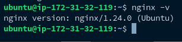
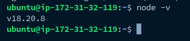
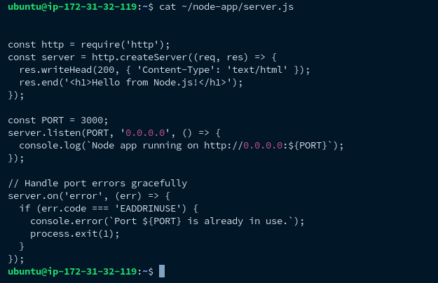
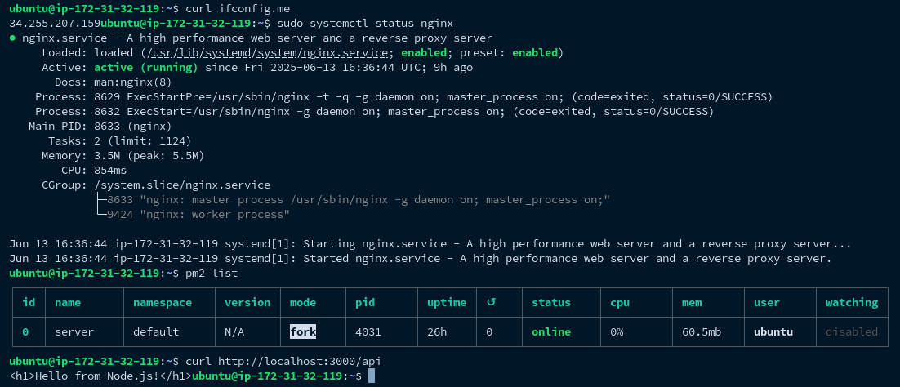
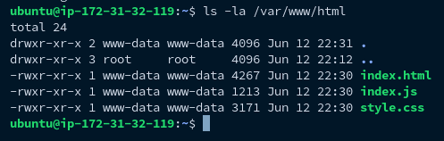
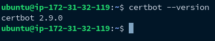
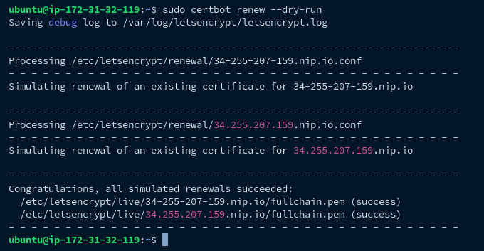
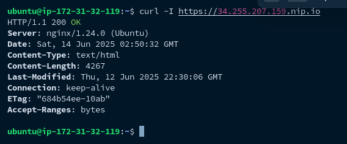

# Cloud-Based Web Server Deployment | AltSchool Semester Project
## Deploying a Secure Nginx Web Server with Node.js Proxy on AWS EC2
## Project Overview: 
 This project involved provisioning an AWS EC2 instance, setting up Nginx as a web server, creating a dynamic landing page, and configuring a reverse proxy for a Node.js application. The system was secured with Let’s Encrypt SSL (HTTPS) and tested for production readiness.

 ### Technologies Used:
 - **Cloud Provider:** AWS EC2 (Ubuntu 24.04 LTS)
 - **Web Server:** Nginx
 - **Backend:** Node.js (for reverse proxy demo)
 - **Security:** Let’s Encrypt (Certbot), UFW firewall
 - **Domain:** `https://34.255.207.159.nip.io/` (temporary SSL domain for IP)

 ##  Step-by-Step Implementation
 ### 1. Provisioning the Server (AWS EC2)
    Launched an Ubuntu 24.04 LTS instance on AWS EC2.


 ####   Security Group Rules:
 - SSH (Port 22)  
- HTTP (Port 80)  
- HTTPS (Port 443)

**Connecting via SSH:**
-  Navigate to the downloaded key pair location 

```bash
ssh -i "key.pem" ubuntu@ec2-34-255-207-159.eu-west-1.compute.amazonaws.com
```

---

## 2. Web Server Setup (Nginx)
**Install Nginx:**

```bash
sudo apt update && sudo apt install nginx -y
```

**Start and Enable Nginx:**
```bash
sudo systemctl start nginx
sudo systemctl enable nginx
```



**Verifying  Installation:**
```bash
curl http://localhost
```
---

## 3. Reverse Proxy (Node.js)

**Install Node.js:**

```bash
sudo apt install -y nodejs
```



**Create `server.js`:**

```js
// server.js
const http = require('http');
const server = http.createServer((req, res) => {
  res.end('Hello from Node.js!');
});
server.listen(3000, 'localhost');
```



**Nginx Reverse Proxy Config:**
```nginx
location /api {
    proxy_pass http://localhost:3000;
}
```



## 4. Dynamic Landing Page

The landing page titled “QuickQueue” showcases a modern and responsive design aimed at presenting the core concept of the project. It introduces QuickQueue as a solution to reduce wait times and streamline customer service experiences across industries. The page includes:

A concise project pitch highlighting the value proposition

The role and responsibilities of the Lead Cloud Engineer 

A brief professional bio, outlining  skills and cloud engineering journey

Subtle UI animations and clean CSS styling to enhance user engagement

The landing page is fully deployed on an Nginx web server and is accessible via domain (secured with SSL). It serves as the user-facing entry point of the project.

**Deploy Files to Web Root:**

```bash
sudo scp -r ~/local/project/* ubuntu@<IP>:/var/www/html/
```



**Set Correct Permissions:**

```bash
sudo chown -R www-data:www-data /var/www/html
```

---

## 5. Networking & Security

**Open Firewall Ports:**

```bash
sudo ufw allow 80/tcp
sudo ufw allow 443/tcp
```

**Install SSL (Let’s Encrypt Certbot):**

```bash
sudo apt install certbot python3-certbot-nginx -y
sudo certbot --nginx -d 34-255-207-159.nip.io
```


**Test Auto-Renewal:**

```bash
sudo certbot renew --dry-run
```


---

## ✅ Verification

| Test                  | Command                             | Expected Output              |
|-----------------------|--------------------------------------|------------------------------|
| HTTP → HTTPS Redirect | `curl -I http://<IP>`                | 301 Moved Permanently        |
| HTTPS Works           | `curl -I https://34.255.207.159.nip.io` | 200 OK                    |
| Node.js Proxy         | `curl http://<IP>/api`               | Hello from Node.js!          |





---


